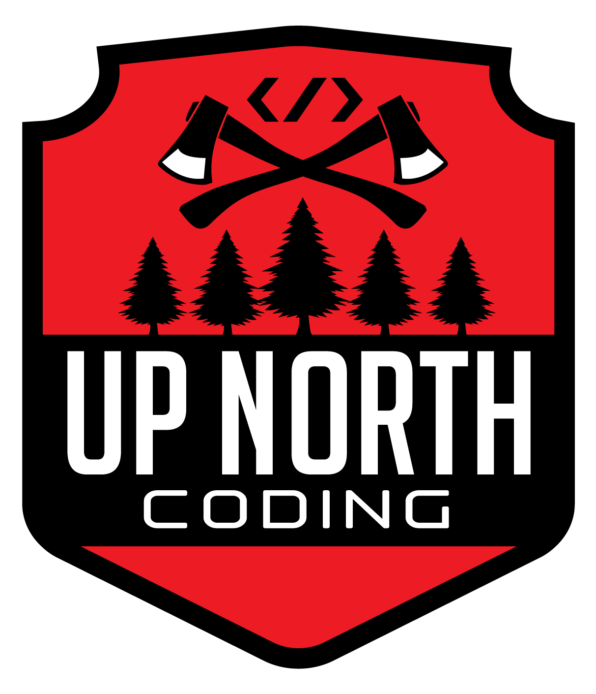

# Jupiter Wallet




React based Jupiter frontend developed by Up North Coding, winners of the [2022 Jupiter Hackathon](https://blog.gojupiter.tech/jupiter-hackathon-9fae1746bf4c).

For development inquiries contact: sales@upnorthcoding.com

## Usage

**Install deps**

```sh
yarn install

yarn husky_setup
```

**Start**

```sh
yarn start
```

**Build**

```sh
yarn build
```

**Test**

```sh
yarn test
```

## Styling

**Mobile Goals**

- Absolute minimum width is 360px

## Dangling Questions

**Accessibility**

Does the wallet need to support accessibility? This wasn't originally discussed/quoted but it appears it might have legal repercussions so might be worth Sigwo Technologies' consideration.

## License

[MIT](LICENSE)
